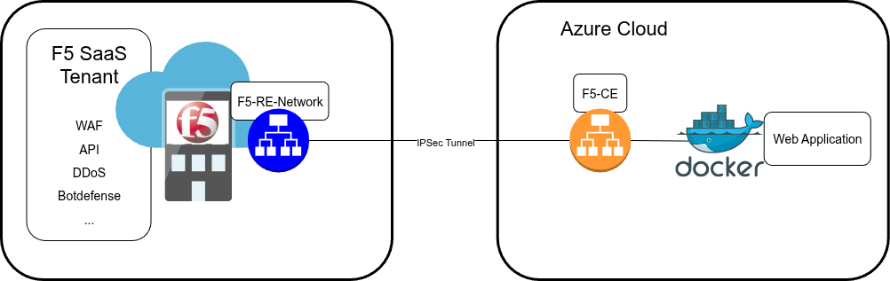

# F5 SaaS (RE-CE) demo with terraform

## Overview
This Terraform project deploys following items:
- Docker host with Demo application (DVWA) on **PROXMOX** 
- CE single NIC Host in **PROXMOX** connected to F5 SaaS platform
- Virtual Server in **F5 Saas** including WAF profile

This repository is for demo or PoC show cases only!

The deployment will create a random id which is 
used for several objects for naming convention.


<p align="center">
  


---

## Getting Started
The modules are available here : https://registry.terraform.io/providers/volterraedge/volterra/latest

## Prerequisites

Before using this Terraform project, ensure you have the following:

- **Terraform CLI** installed on your machine
- API Certificate (P12 file and URL) for **F5 SaaS** access
- An third-level-domain in F5 SaaS for service deplyoment (DNS Delegation)
  - In this case we use let's encrypt while configuring Autocert for TLS key material

Doc for API Certificate generation: https://docs.cloud.f5.com/docs/how-to/user-mgmt/credentials 

---

```
project-directory/
├── ce-data.tpl
├── LICENSE
├── main.tf
├── providers.tf
├── README.md
├── terraform.tfvars.example
└── vars.tfxc-cloud.drawio.png
└── xc-cloud.drawio.png
└── xc-lb.tf
```

---

## Configuration Steps

### 1. Clone the Repository

```bash
git clone <repository_url>
cd <repository_name>
```

### 2. export F5 SaaS variables

"export" the env variables to authenticate via terraform:

```
export VES_P12_PASSWORD=<P12_cert_password>
export VOLT_API_URL=https://f5-emea-ent.console.ves.volterra.io/api
export VOLT_API_P12_FILE=/path/to/the/p12/file_api-creds.p12
```


### 3. Update Variables

#### Modify `terraform.tfvars`
```bash
cp terraform.tfvars.example terraform.tfvars
```
Update the values in `terraform.tfvars` to match your deployment needs.

Here are the main key variables to configure:

- **Planet wide Variables:**
  ```hcl
  prefix = "your-prefix"
  ```

- **XC wide Variables:**
  ```hcl
  xc_tenant = "your-tenant"
  xc_namespace = "your-namespace"
  xc_app_domain = "your-third-level-domain"
  ```

### 4. Initialize Terraform

Run the following command to initialize Terraform and download required providers:

```bash
terraform init
```

### 5. Plan the Deployment

Verify the configuration by running:

```bash
terraform plan
```

This command shows the resources Terraform will create.

### 6. Deploy the Resources

Apply the configuration to create resources in Azure:

```bash
terraform apply
```

Type `yes` to confirm the deployment or add the argument `--auto-approve`.

---

## Cleanup

To destroy all resources created by this project, run:

```bash
terraform destroy
```

Type `yes` to confirm the deletion or add the argument `--auto-approve`.

---

